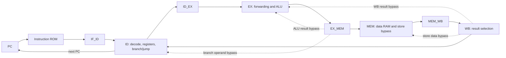

# 4-bit Pipelined MIPS Processor — A1 Group 1

## 1. Introduction: from single-cycle MIPS to a pipeline

A single-cycle MIPS processor completes an instruction in one clock cycle: it fetches the instruction, decodes it and reads registers, performs an ALU operation, accesses data memory if necessary, and writes a result back to a register. A control unit selects the datapath operations for each instruction. The clock period must accommodate the longest instruction path, typically a load through instruction memory, the register file, the ALU, data memory, and write-back.

Pipelining separates this work into stages with registers between them. Different instructions can then occupy different stages at the same time. After the pipeline fills, an ideal five-stage pipeline completes one instruction per cycle, although each instruction still passes through several stages. Dependencies and changes in control flow require forwarding, stalls, and flushing to preserve program behavior.

This project implements the MIPS processor along with pipelining using a **custom 16-bit instruction format and a 4-bit datapath**. It is an educational MIPS-style architecture; standard 32-bit MIPS machine code and assemblers are not compatible with it.

The supplied implementation is [MIPS_Pipeline_Final.circ](MIPS_Pipeline_Final.circ), saved with Logisim-evolution 4.1.0. This document describes the circuit and Java assembler as supplied, including implementation limits. The assignment establishes the ISA and group mapping; circuit widths, wiring, ROM contents, and assembler code establish the behavior documented below.

### Contents

1. [Introduction](#1-introduction-from-single-cycle-mips-to-a-pipeline)
2. [Architecture and registers](#2-architecture-and-registers)
3. [Instruction set and encoding](#3-instruction-set-and-encoding)
4. [Control ROM and control signals](#4-control-rom-and-control-signals)
5. [Datapath and circuit organization](#5-datapath-and-circuit-organization)
6. [Pipeline implementation](#6-pipeline-implementation)
7. [Four hazard cases and their solutions](#7-four-hazard-cases-and-their-solutions)
8. [Implementation boundaries](#8-implementation-boundaries)
9. [Writing, assembling, and executing programs](#9-writing-assembling-and-executing-programs)

## 2. Architecture and registers

### 2.1 Machine parameters

| Property | Implemented value |
| --- | --- |
| Instruction width | 16 bits |
| Opcode width | 4 bits; all 16 opcodes are assigned |
| Register value / ALU width | 4 bits |
| Register selector field | 4 bits |
| Supported register names | `$zero`, `$t0`–`$t4`, `$sp` |
| PC / instruction address width | 8 bits |
| Instruction ROM | 256 locations × 16 bits |
| Instruction addressing | One address per instruction; sequential PC increment is **1** |
| Data RAM | **16 locations × 4 bits**, with a 4-bit address input |
| Control ROM | 16 locations × 12 bits |
| Pipeline | IF → ID → EX → MEM → WB |
| Pipeline registers | `IF_ID`, `ID_EX`, `EX_MEM`, `MEM_WB` |
| Memory organization | Separate instruction ROM and data RAM |

The assignment specifies an 8-bit address bus. In this circuit, instruction addressing uses eight bits, but data addresses come from the four-bit ALU and the RAM is configured with `addrWidth=4`. Consequently, software can access data locations `0x0`–`0xF`, not 256 data locations.

### 2.2 Register encoding

| Register | Binary selector | Hex selector | Purpose |
| --- | --- | --- | --- |
| `$zero` | `0000` | `0` | Zero source; ordinary instructions cannot enable writes to it |
| `$t0` | `0001` | `1` | General-purpose temporary |
| `$t1` | `0010` | `2` | General-purpose temporary |
| `$t2` | `0011` | `3` | General-purpose temporary |
| `$t3` | `0100` | `4` | General-purpose temporary |
| `$t4` | `0101` | `5` | General-purpose temporary |
| `$sp` | `0110` | `6` | Software-managed stack pointer; also usable as an ordinary register |

`RegFile` contains seven four-bit Register components. The register labeled `zero` has its write enable tied low; after a normal zero initialization it stays zero during instruction execution. The other six write enables combine `RegWrite` with the decoded destination selector. Forwarding and hazard checks exclude destination selector zero.

The assembler rejects other register names, including numeric aliases such as `$1`. Selectors `7`–`F` are outside the supported programming interface; the circuit's unused read-multiplexer inputs are tied to zero.

### 2.3 Four-bit arithmetic

All register results are four-bit bit patterns. Arithmetic wraps modulo 16, with no implemented overflow exception:

```text
0xF + 0x1 = 0x0
0x3 - 0x5 = 0xE
```

The same pattern can be viewed as unsigned `0`–`15` or signed two's-complement `-8`–`7`. For example, `0xE` represents unsigned 14 or signed -2. Equality comparisons compare the bits, so this interpretation does not change `beq` or `bneq`.

Data effective addresses also wrap at four bits:

```text
effective_address = (R[base] + offset_nibble) & 0xF
```

Each data address selects one four-bit value. The names `lw` and `sw` do not imply a 32-bit word, byte addressing, or multiplication of an address by four on this machine.

## 3. Instruction set and encoding

### 3.1 Opcode assignment

The instruction-ID sequence is as follows:

`R[x]` denotes a register value, `M[a]` a four-bit data-memory value, and `PC` the address of the instruction being described. Arithmetic and logical results are restricted to four bits.

| Opcode hex | Opcode binary | Assignment ID | Mnemonic / assembly syntax | Format | Operation |
| --- | --- | --- | --- | --- | --- |
| `0` | `0000` | I | `sll rd, rs, shamt` | S | `R[rd] = (R[rs] << k) & 0xF` |
| `1` | `0001` | F | `andi rt, rs, imm` | I | `R[rt] = R[rs] & imm` |
| `2` | `0010` | M | `sw rt, offset(base)` | I | `M[(R[base] + offset) & 0xF] = R[rt]` |
| `3` | `0011` | J | `srl rd, rs, shamt` | S | `R[rd] = R[rs] >>> k` (logical, zero-filled) |
| `4` | `0100` | H | `ori rt, rs, imm` | I | `R[rt] = R[rs] OR imm` |
| `5` | `0101` | L | `lw rt, offset(base)` | I | `R[rt] = M[(R[base] + offset) & 0xF]` |
| `6` | `0110` | N | `beq rs, rt, target` | I | Branch if `R[rs] == R[rt]` |
| `7` | `0111` | G | `or rd, rs, rt` | R | `R[rd] = R[rs] OR R[rt]` |
| `8` | `1000` | D | `subi rt, rs, imm` | I | `R[rt] = (R[rs] - imm) & 0xF` |
| `9` | `1001` | A | `add rd, rs, rt` | R | `R[rd] = (R[rs] + R[rt]) & 0xF` |
| `A` | `1010` | B | `addi rt, rs, imm` | I | `R[rt] = (R[rs] + imm) & 0xF` |
| `B` | `1011` | E | `and rd, rs, rt` | R | `R[rd] = R[rs] & R[rt]` |
| `C` | `1100` | C | `sub rd, rs, rt` | R | `R[rd] = (R[rs] - R[rt]) & 0xF` |
| `D` | `1101` | O | `bneq rs, rt, target` | I | Branch if `R[rs] != R[rt]` |
| `E` | `1110` | K | `nor rd, rs, rt` | R | `R[rd] = ~(R[rs] OR R[rt]) & 0xF` |
| `F` | `1111` | P | `j target` | J | `PCnext = target_address` |

Here `rd`, `rs`, `rt`, and `base` are placeholders for supported register names. The branch mnemonic is **`bneq`**, not `bne`.

### 3.2 Instruction formats

Every instruction consists of four hexadecimal digits, with the opcode in the most significant nibble. There is no additional function field.

| Format | Bits `[15:12]` | Bits `[11:8]` | Bits `[7:4]` | Bits `[3:0]` |
| --- | --- | --- | --- | --- |
| R | Opcode | Source 1 (`rs`) | Source 2 (`rt`) | Destination (`rd`) |
| S | Opcode | Source (`rs`) | Destination | Shift amount |
| I, arithmetic / logical | Opcode | Source (`rs`) | Destination (`rt`) | Immediate |
| I, load / store | Opcode | Base register | Load destination / store source | Offset |
| I, branch | Opcode | Source 1 | Source 2 | Signed PC-relative displacement |
| J | Opcode | Target address `[7:4]` | Target address `[3:0]` | `0000` |

Assembly lists a result register first and the machine encoding places it after the source field(s).

### 3.3 Immediates, branches, and jumps

| Operand kind | Assembler range | Encoding / interpretation |
| --- | --- | --- |
| Arithmetic / logical immediate | `-8` through `15` | Low four bits; e.g. `-1` and `15` both encode as `F` |
| Load / store offset | `-8` through `15` | Low four bits, added by the four-bit ALU |
| Shift amount | `0` through `15` | Four bits encoded; hardware uses only the low two |
| Numeric branch operand | `-8` through `7` | Signed displacement from the following instruction |
| Branch label | Must resolve within `-8` through `7` instructions of `PC + 1` | Assembler computes the displacement |
| Jump address / label | `0` through `255` | Absolute eight-bit instruction address |

For a branch:

```text
offset = target_address - (branch_address + 1)
if condition is true:
    PCnext = (branch_address + 1 + sign_extend_4_to_8(offset)) & 0xFF
else:
    PCnext = (branch_address + 1) & 0xFF
```

The circuit carries `PC + 1` in `IF_ID`, so the target uses the branch's own following address even when fetch has advanced. The branch offset is sign-extended to eight bits before addition. A numeric operand is a displacement, not an absolute address: `beq $t0, $t1, 2` skips two instructions when taken.

Jump addressing is absolute and instruction-based.

## 4. Control ROM and control signals

### 4.1 ROM-based control

`ControlRom` implements the ROM-based control-word requirement. The decoded opcode addresses a 16-entry ROM, and each entry supplies a 12-bit control word. This is a direct opcode-to-control lookup.

The control word is decoded in ID. Branch and jump controls are consumed there. The controls required later are packed into the pipeline registers and travel with their instruction.

### 4.2 Exact 12-bit control-word layout

```text
Bit:   11      10        9        8        7         6        5    4     3      2:0
      RegDst RegWrite ALUSrc  MemRead  MemWrite  MemtoReg   beq  bneq  Jump   ALUOp
```

| Signal | Width | Meaning |
| --- | --- | --- |
| `RegDst` | 1 | `0`: destination is instruction `[7:4]`; `1`: destination is `[3:0]` |
| `RegWrite` | 1 | Enable the destination register write in WB; `$zero` remains protected |
| `ALUSrc` | 1 | `0`: select register operand B; `1`: select the low instruction nibble as immediate / offset / shift amount |
| `MemRead` | 1 | Enable data-memory reading for a load; also identifies loads to hazard logic |
| `MemWrite` | 1 | Enable the data-memory write for a store |
| `MemtoReg` | 1 | `0`: write back the ALU result; `1`: write back the RAM result |
| `beq` | 1 | Enable the equality branch condition in ID |
| `bneq` | 1 | Enable the inequality branch condition in ID |
| `Jump` / `j` | 1 | Select the absolute jump address in ID |
| `ALUOp` | 3 | Select the ALU function below |

### 4.3 ALU function codes

| `ALUOp` | Function | Used by |
| --- | --- | --- |
| `000` | Add | `add`, `addi`, `lw`, `sw`; also the harmless default for `j` / bubbles |
| `001` | Subtract | `sub`, `subi`; also encoded for `beq`, `bneq` |
| `010` | AND | `and`, `andi` |
| `011` | OR | `or`, `ori` |
| `100` | NOR | `nor` |
| `101` | Logical shift left | `sll` |
| `110` | Logical shift right | `srl` |
| `111` | Unused | No instruction selects it |

The ALU also produces a `zero` output when all result bits are zero. In this pipeline, branch resolution uses the separate ID-stage `branch_decision` circuit; it does not wait for the EX-stage ALU zero output. However, this was needed for the single-cycle implementation.

### 4.4 Complete control truth table

These are the **actual stored values**, including zeros in positions that could be treated as don't-cares for some instructions.

Abbreviations: `RD` = RegDst, `RW` = RegWrite, `AS` = ALUSrc, `MR` = MemRead, `MW` = MemWrite, `MTR` = MemtoReg, `EQ` = beq, `NE` = bneq, `J` = Jump.

| Opcode | Instruction | RD | RW | AS | MR | MW | MTR | EQ | NE | J | ALUOp | Control word |
| --- | --- | --- | --- | --- | --- | --- | --- | --- | --- | --- | --- | --- |
| `0` | `sll` | 0 | 1 | 1 | 0 | 0 | 0 | 0 | 0 | 0 | `101` | `605` |
| `1` | `andi` | 0 | 1 | 1 | 0 | 0 | 0 | 0 | 0 | 0 | `010` | `602` |
| `2` | `sw` | 0 | 0 | 1 | 0 | 1 | 0 | 0 | 0 | 0 | `000` | `280` |
| `3` | `srl` | 0 | 1 | 1 | 0 | 0 | 0 | 0 | 0 | 0 | `110` | `606` |
| `4` | `ori` | 0 | 1 | 1 | 0 | 0 | 0 | 0 | 0 | 0 | `011` | `603` |
| `5` | `lw` | 0 | 1 | 1 | 1 | 0 | 1 | 0 | 0 | 0 | `000` | `740` |
| `6` | `beq` | 0 | 0 | 0 | 0 | 0 | 0 | 1 | 0 | 0 | `001` | `021` |
| `7` | `or` | 1 | 1 | 0 | 0 | 0 | 0 | 0 | 0 | 0 | `011` | `C03` |
| `8` | `subi` | 0 | 1 | 1 | 0 | 0 | 0 | 0 | 0 | 0 | `001` | `601` |
| `9` | `add` | 1 | 1 | 0 | 0 | 0 | 0 | 0 | 0 | 0 | `000` | `C00` |
| `A` | `addi` | 0 | 1 | 1 | 0 | 0 | 0 | 0 | 0 | 0 | `000` | `600` |
| `B` | `and` | 1 | 1 | 0 | 0 | 0 | 0 | 0 | 0 | 0 | `010` | `C02` |
| `C` | `sub` | 1 | 1 | 0 | 0 | 0 | 0 | 0 | 0 | 0 | `001` | `C01` |
| `D` | `bneq` | 0 | 0 | 0 | 0 | 0 | 0 | 0 | 1 | 0 | `001` | `011` |
| `E` | `nor` | 1 | 1 | 0 | 0 | 0 | 0 | 0 | 0 | 0 | `100` | `C04` |
| `F` | `j` | 0 | 0 | 0 | 0 | 0 | 0 | 0 | 0 | 1 | `000` | `008` |


### 4.5 Pipeline and flow-control signals

| Signal | Source | Effect |
| --- | --- | --- |
| `Stall` | `HazardDetectionUnit` | Selects an all-zero control word, inserting an instruction with no register or memory side effects into EX |
| `PCWrite` | `HazardDetectionUnit` | PC enable; low holds the fetch address |
| `IF_ID_Write` | `HazardDetectionUnit` | IF/ID enable; low holds the instruction currently decoding |
| `is_immediate` | Raw control-word `ALUSrc` bit | Indicates that field `[7:4]` is not an EX-stage register-B operand |
| `is_branch` | Raw `beq OR bneq` | Selects branch-specific dependency checks |
| `ForwardA`, `ForwardB` | `FWD_Unit` | Select ordinary or forwarded operands |
| `FWD_SW` | `FWD_Unit` | Select forwarded register data for a store independently of `ALUSrc` |
| `fwd` | `MemtoMem_fwd_unit` | Selects WB data at the RAM write-data input |
| `Branch` | `branch_decision` | True when an enabled branch's comparison succeeds |
| `PCsrc` | Packed `j` and `Branch` bits | Selects the next-PC input |
| `R` | Input beside the `Restart` text | Clears PC and the four pipeline registers |
| `CLK` | Main clock | Drives the pipeline, register file, and data RAM |

`PCsrc` is a two-bit selector with `Branch` as bit 0 and `j` as bit 1:

| `PCsrc` | Next-PC source |
| --- | --- |
| `00` | Current fetch PC + 1 |
| `01` | ID-stage branch target |
| `10` | ID-stage jump target |
| `11` | Unused for valid decoded instructions |

When `Stall=1`, both write enables become zero. The control-word mux also clears the branch/jump enables, preventing a waiting branch from redirecting the PC using unavailable operands. Raw `is_branch` and `is_immediate` remain available to the hazard detector.

## 5. Datapath and circuit organization

### 5.1 Main functional blocks

| Circuit | Role |
| --- | --- |
| `Main` | Connects all stages, pipeline registers, memories, clock/reset, and bypass paths |
| `InstrMem` | 256 × 16 instruction ROM addressed by the PC |
| `ControlRom` | Opcode-to-control-word lookup |
| `RegFile` | Seven four-bit register components, read selection, and write decoding |
| `ALU` | Four-bit arithmetic, logic, shifts, and zero detection |
| `FWD_Unit` | Dependency comparisons and forwarding selection; instantiated twice |
| `HazardDetectionUnit` | Load-use and early-branch dependency stalls |
| `MemtoMem_fwd_unit` | WB-to-MEM store-data bypass selection |
| `branch_decision` | Compares forwarded operands and combines `beq` / `bneq` conditions |

One `FWD_Unit` serves EX operands and store data; the other serves ID-stage branch operands. The ID instance has its immediate input tied low so both branch operands can be forwarded.

### 5.2 Pipeline overview



The hazard detector additionally controls the PC and IF/ID enables and the ID control-word mux. Branch/jump redirection controls a mux that replaces the next IF/ID contents with zeros.

### 5.3 Clocking and restart

The PC and pipeline registers use rising-edge updates. Register-file writes explicitly use the **falling edge**, allowing a result in WB to become visible to register reads before the next rising-edge ID/EX capture. Data RAM is configured for asynchronous reading and uses the main clock for writes.

The input beside `Restart` drives the `R` tunnel to the PC, `IF_ID`, `ID_EX`, `EX_MEM`, and `MEM_WB` clear inputs. It does **not** connect to register-file clears or to a RAM-clear control. A restart of the pipeline can therefore preserve old architectural register and memory values. Use a fresh simulation state and explicit initialization when a clean run is required; see the execution instructions below.

### 5.4 Component inventory

The table counts functional Logisim primitives in the expanded `Main` hierarchy, counting both instances of `FWD_Unit`. These are simulation components, not a count of physical packaged ICs.

| Component | Count | Notes |
| --- | --- | --- |
| Register | 12 | Seven register-file registers, PC, four pipeline registers |
| ROM | 2 | Instruction ROM and control ROM |
| RAM | 1 | Data memory |
| Multiplexer | 22 | Includes register selection, ALU selection, forwarding, and control muxes |
| Decoder | 1 | Register write selection |
| Adder | 3 | ALU add, PC + 1, branch-target addition |
| Subtractor | 1 | ALU subtraction |
| Shifter | 2 | Logical left and logical right |
| Comparator | 24 | Forwarding, hazard detection, and branch decision |
| AND gate | 31 | Includes write enables and dependency qualification |
| OR gate | 8 | Includes hazard and branch combination |
| NOR gate | 2 | ALU NOR and zero detection |
| NOT gate | 13 | Control and dependency inversion |
| XOR gate | 1 | Branch operand comparison |
| Bit extender | 1 | Branch-offset sign extension |
| Clock | 1 | Main clock source |

Wires, pins, tunnels, splitters, constants, and text labels are excluded from this functional inventory.

## 6. Pipeline implementation

### 6.1 Responsibilities of each stage

| Stage | Work performed |
| --- | --- |
| **IF — Instruction Fetch** | Read `InstrMem[PC]`, calculate `PC + 1`, and capture the instruction and following address in IF/ID |
| **ID — Instruction Decode** | Split instruction fields, read registers and control ROM, detect hazards, calculate branch/jump targets, forward branch operands, and resolve control flow |
| **EX — Execute** | Select destination, forward ALU operands, select register/immediate B, calculate arithmetic / logic / effective address, and forward store data |
| **MEM — Memory Access** | Read or write data RAM; apply the final store-data bypass when needed |
| **WB — Write Back** | Select RAM data or ALU result using `MemtoReg`; write the destination if `RegWrite=1` |

Stores, branches, and jumps do not write a general-purpose register. Instructions that do not access RAM pass their result and controls through MEM to WB.

### 6.2 Pipeline-register contents

Bit positions below refer to the saved circuit's packed register buses.

| Register | Width | Stored fields |
| --- | --- | --- |
| `IF_ID` | 24 | `[7:0]`: instruction's `PC + 1`; `[23:8]`: instruction |
| `ID_EX` | 29 | `[3:0]`: read data 1; `[7:4]`: read data 2; `[11:8]`: instruction low nibble; `[15:12]`: instruction `[7:4]`; `[24:16]`: nine execution/memory/WB control bits; `[28:25]`: source-1 register number |
| `EX_MEM` | 20 | `[3:0]`: ALU result; `[7:4]`: forwarded store data; `[11:8]`: selected destination; `[15:12]`: four memory/WB control bits; `[19:16]`: original source-2 / `rt` field |
| `MEM_WB` | 14 | `[3:0]`: ALU result; `[7:4]`: RAM result; `[11:8]`: destination; `[12]`: MemtoReg; `[13]`: RegWrite |

The nine-bit control bundle in ID/EX is repacked from the ROM word:

```text
ID_EX control bundle [8:0]:
  [8] RegWrite
  [7] MemtoReg
  [6] MemRead
  [5] MemWrite
  [4] RegDst
  [3] ALUSrc
  [2:0] ALUOp

EX_MEM control bundle [3:0]:
  [3] RegWrite
  [2] MemtoReg
  [1] MemRead
  [0] MemWrite
```

The instruction low nibble is retained because it serves as the R-type destination, immediate, offset, or shift amount. Keeping both the selected destination and original `rt` in EX/MEM allows register write-back checks and store-data checks to use the appropriate register number.

### 6.3 Ideal timing

For independent instructions, with no stalls or redirects:

| Instruction | Cycle 1 | Cycle 2 | Cycle 3 | Cycle 4 | Cycle 5 | Cycle 6 | Cycle 7 |
| --- | --- | --- | --- | --- | --- | --- | --- |
| I1 | IF | ID | EX | MEM | WB | | |
| I2 | | IF | ID | EX | MEM | WB | |
| I3 | | | IF | ID | EX | MEM | WB |

An ideal sequence of `N` instructions takes `N + 4` stage cycles through WB. Stalls and discarded fetches increase the actual count. A five-stage pipeline improves overlap and potential throughput; this project does not provide a measured clock-frequency or speedup benchmark.

### 6.4 Bubbles versus flushes

**Stall bubble:** hold the PC and IF/ID while loading a zero control word into ID/EX. Older instructions continue through EX, MEM, and WB so the needed result can become available. `RegWrite=0` and `MemWrite=0` make the bubble harmless even though its data fields may contain old instruction bits.

**Control-flow flush:** when an ID-stage branch is taken or a jump is decoded, select its target for the PC and replace the next IF/ID input with 24 zero bits. Since the decision is made in ID, the younger sequential instruction in IF is the one discarded. Earlier instructions continue normally.

An all-zero instruction is `sll $zero, $zero, 0`. It has no architectural effect because writes to register zero are disabled. This makes the zero instruction inserted by the IF/ID flush safe. The assembler does not provide a `nop` mnemonic and does not insert padding instructions automatically.

## 7. Four hazard cases and their solutions

The four concrete cases handled by this implementation are **ALU/register dependencies**, **load-use dependencies**, **branch/control-flow hazards**, and **store-data dependencies**. The first, second, and fourth are forms of read-after-write (RAW) data hazard; this is a breakdown of the implemented cases rather than four independent textbook hazard classes.

### 7.1 Case 1: ALU-result / register RAW hazard

```asm
addi $t0, $zero, 5
add  $t1, $t0, $t0
```

The `add` needs `$t0` before the preceding `addi` has written it to the register file. Reading only the value captured in ID/EX would use stale data.

**Solution: EX operand forwarding.** `FWD_Unit` compares each source number with the destinations in EX/MEM and MEM/WB. A match is usable only when the producer has `RegWrite=1` and its destination is not `$zero`.

| Selection | Forwarding mux input |
| --- | --- |
| `00` | Original operand |
| `01` | Final WB value selected from MEM/WB |
| `10` | EX/MEM ALU result |
| `11` | Not emitted by the forwarding unit |

If both stages match, EX/MEM takes priority because it contains the newer producer. Conceptually, for source `s`:

```text
if EX_MEM.RegWrite and EX_MEM.dest != 0 and EX_MEM.dest == s:
    select EX_MEM.ALUResult
else if MEM_WB.RegWrite and MEM_WB.dest != 0 and MEM_WB.dest == s:
    select WBValue
else:
    select captured_register_value
```

`ForwardB` is suppressed when `ALUSrc=1`, preserving the immediate or offset selected for ALU operand B. `ForwardA` still works, so arithmetic-immediate instructions and load/store bases can receive forwarded values. Ordinary ALU-to-ALU RAW dependencies therefore need no inserted stall.

The falling-edge register-file write also makes WB results visible to ID before the next rising-edge capture, covering dependencies that have already reached write-back.

### 7.2 Case 2: load-use hazard

```asm
lw  $t0, 0($zero)
add $t1, $t0, $t2
```

At the end of the load's EX stage, EX/MEM contains the **memory address**, not the loaded value. The immediately following ALU instruction cannot use that address as a substitute for the load result.

**Solution: one stall followed by WB forwarding.** For a non-branch instruction in ID, the detector checks:

```text
load_use = ID_EX.MemRead
           and ID_EX.rt != 0
           and (ID_EX.rt == IF_ID.rs
                or (not IF_ID.is_immediate and ID_EX.rt == IF_ID.rt))
```

When true:

1. Set `PCWrite=0` and `IF_ID_Write=0`, holding fetch and decode.
2. Set `Stall=1`, putting zero controls into ID/EX for one cycle.
3. Allow the load to advance through MEM.
4. Release the stall; the consumer enters EX and receives the loaded value from WB.

| Instruction | C1 | C2 | C3 | C4 | C5 | C6 | C7 |
| --- | --- | --- | --- | --- | --- | --- | --- |
| `lw` | IF | ID | EX | MEM | WB | | |
| dependent `add` | | IF | ID: hazard | ID: held | EX: WB forwarded | MEM | WB |
| inserted bubble | | | | EX | MEM | WB | |

A dependent load/store **base address** also requires this stall because the base is needed in EX. A store whose only dependency is its data value is handled by Case 4.

### 7.3 Case 3: branch dependencies and control-flow hazards

Control flow has two related problems: a branch may compare stale register values, and the sequential instruction already being fetched may be on the wrong path.

**Solution Step-1: early comparison with forwarding and stalls.** `branch_decision` resolves branches in ID using two operand muxes driven by the second `FWD_Unit`. It receives either register-file data, the EX/MEM ALU result, or the final WB value.

```text
equal = (Data1 == Data2)
Branch = (beq and equal) or (bneq and not equal)
```

ID cannot consume a result that is still being calculated in EX. It also cannot use a load's EX/MEM ALU result, because that is an address. The branch-specific stall condition is:

```text
ex_dependency = ID_EX.RegWrite and ID_EX.dest != 0
                and (ID_EX.dest == IF_ID.rs or ID_EX.dest == IF_ID.rt)

mem_load_dependency = EX_MEM.MemRead and EX_MEM.dest != 0
                     and (EX_MEM.dest == IF_ID.rs or EX_MEM.dest == IF_ID.rt)

branch_stall = ex_dependency or mem_load_dependency
Stall = IF_ID.is_branch ? branch_stall : load_use
```

Typical timing consequences:

| Producer / branch relationship | Dependency stalls before comparison |
| --- | --- |
| ALU producer immediately before dependent branch | 1; then forward its EX/MEM ALU result into ID |
| Load immediately before dependent branch | 2; wait through EX and MEM, then use WB data |
| Load in EX/MEM when dependent branch reaches ID | 1; wait for Load to read from memory |
| Needed ALU result already in EX/MEM | 0; forward directly |
| Needed result already in WB | 0; use WB forwarding / updated register data |


**Solution Step-2: redirect and flush.** Fetch normally follows `PC + 1`. Once a ready branch is taken, or a jump is decoded, the next-PC mux selects the target and the IF/ID input is zeroed. The sequential instruction being fetched is discarded. A not-taken branch continues sequentially without a redirect flush.

With no dependency stall, a taken branch or jump discards one fetch slot. Dependency stalls add to that penalty. There is no software-visible branch delay slot: the instruction immediately after a taken branch or jump must not be relied on to execute.

### 7.4 Case 4: store-data hazard, including load-to-store

```asm
lw $t0, 0($zero)
sw $t0, 1($zero)
```

For `sw`, ALU operand B is the address offset. The value to store is a separate register operand. Forwarding only the ALU inputs would therefore leave the RAM write-data path stale.

**Solution: two store-data bypass points.**

1. **EX-stage store forwarding:** `FWD_SW` controls a separate mux that selects captured register data, WB data, or the EX/MEM ALU result. Unlike `ForwardB`, this selection is not disabled by `ALUSrc=1`. The result is saved in EX/MEM as store data.
2. **MEM-stage correction:** `MemtoMem_fwd_unit` compares the store's saved source register with the WB destination and, when they match, routes the final WB value directly to the RAM write-data input.

The MEM-stage forwarding condition is:

```text
fwd = MEM_WB.RegWrite
      and MEM_WB.dest != 0
      and MEM_WB.dest == EX_MEM.rt

RAMWriteData = fwd ? WBValue : EX_MEM.StoreData
```

`MemWrite` independently determines whether RAM is actually written. The forwarding comparator does not need a separate store enable to select the data input.

In an adjacent `lw` → `sw` pair with only a data dependency, the load reaches WB as the store reaches MEM. The final bypass supplies the loaded value at the point of writing, so **no load-use stall is needed for the store data alone**. Although an earlier EX bypass may momentarily select the load's address, the MEM bypass replaces it before the store commits.

If the loaded register is the store's **base**, a stall is still required:

```asm
lw $t0, 0($zero)
sw $t1, 0($t0)       # t0 is required for EX-stage address calculation
```

### 7.5 Structural hazards and write ordering

Instruction fetch and data access use different memories, so an IF-stage instruction read can overlap a MEM-stage load/store without competing for one memory port. Register reads have two ports, and in-order WB has one write port. Falling-edge register writes and rising-edge pipeline captures support register read/write timing within a cycle.

This in-order pipeline does not execute younger instructions ahead of older ones or write their results out of order. It therefore does not need register renaming or separate WAR/WAW hazard machinery.

## 8. Implementation boundaries

These details matter when writing or interpreting programs:

- **Data memory is 16 × 4 bits.** Effective addresses wrap modulo 16; the eight-bit PC does not enlarge data RAM.
- **No halt instruction exists.** End a program with a self-jump such as `DONE: j DONE`, then stop automatic clock ticks when inspecting the result.
- **No pseudo-instructions or directives exist.** `li`, `move`, `nop`, `push`, `pop`, `halt`, `.text`, `.data`, and `.word` are not parsed. Use supported instructions directly; e.g. `addi $t0, $zero, 5` loads the bit pattern 5.
- **The stack shares data RAM.** `$sp` is supported, but there is no separate stack memory, automatic stack initialization, stack overflow detection, or dedicated push/pop opcode.
- **Restart only clears PC and pipeline state.** Register-file and RAM contents need separate initialization for reproducible runs.
- **The assembler emits exactly the source instructions.** It inserts no hazard NOPs, padding, or termination code, and does not clear old instruction-ROM contents.
- **Program capacity must be respected manually.** The assembler checks jump targets and branch displacements, but does not reject a source solely for exceeding 256 instructions. Keep the program within ROM addresses `00`–`FF`.

## 9. Writing, assembling, and executing programs

### 9.1 Requirements

- **JDK 21 or newer** is suitable for the complete workflow: the bundled Logisim 4.1.0 JAR contains Java 21 classes, and the GUI assembler launcher requires JDK 21+.
- The command-line assembler can also be compiled for Java 8 independently.

Check both Java commands, since they can point to different installations:

```powershell
java -version
javac -version
```

If `java` resolves to an older runtime, invoke `java.exe` from the same JDK directory as `javac.exe`, as shown below.

### 9.2 Assembly source rules

The assembler performs two passes: first it associates labels with instruction addresses starting at zero, then it encodes instructions and resolves references. Labels and blank/comment-only lines occupy no ROM locations.

```asm
# Hash comments are supported.
START: addi $t0, $zero, 5   // Double-slash comments are also supported.
       subi $t0, $t0, 1
       bneq $t0, $zero, START
```

- Use one instruction per line; a label may be on its own line or before an instruction.
- Mnemonics and register names are case-insensitive. Label lookup is case-sensitive.
- Commas between operands are optional. Spaces and tabs between tokens are accepted.
- Write memory operands as a single token, such as `3($t0)` or `-1($sp)`. Include an explicit offset: `0($sp)`, not `($sp)`.
- Integers can be decimal (`10`), hexadecimal (`0xA`), or binary (`0b1010`). Negative decimal, hexadecimal, and binary values are accepted where the operand range allows them.
- Use `#` or `//` for comments; semicolon comments are not supported.
- Duplicate labels, unsupported registers/instructions, incorrect operand counts, invalid memory syntax, and out-of-range operands produce assembler errors.
- An unresolved branch/jump name falls through to numeric parsing and may be reported as an invalid number.
- Comment-only or empty input is rejected.

### 9.3 Complete example

Enter the following in `MIPS_Assembler/CommandLineAssembler/program.asm`. This example initializes every data value it reads, exercises register forwarding, a load-use stall, store-data forwarding, and a taken branch, then loops at `DONE`.

```asm
addi $t0, $zero, 5
addi $t1, $zero, 3
add  $t2, $t0, $t1       # t2 = 8; receives recent ALU results
sw   $t2, 0($zero)       # M[0] = 8; forwarded store data
lw   $t3, 0($zero)
add  $t4, $t3, $t0       # load-use dependency; t4 = 13 = 0xD
sw   $t4, 1($zero)       # M[1] = 0xD
lw   $t0, 1($zero)
sw   $t0, 2($zero)       # load-to-store data bypass; M[2] = 0xD
beq  $t0, $t4, DONE      # taken; waits if the load is not yet available
addi $t2, $zero, 0       # wrong-path instruction: must be discarded
DONE: j DONE
```

Expected Logisim image:

```text
v2.0 raw
A015
A023
9123
2030
5040
9415
2051
5011
2012
6151
A030
F0B0
```

The branch is at address `09`; `DONE` is at `0B`. Its displacement is `0B - (09 + 1) = 1`. The jump encodes absolute target `0B` as `F0B0`.

After the useful instructions retire, expected architectural results are:

| Location | Expected hexadecimal value |
| --- | --- |
| `$zero` | `0` |
| `$t0` | `D` |
| `$t1` | `3` |
| `$t2` | `8` — proves the wrong-path clear was skipped |
| `$t3` | `8` |
| `$t4` | `D` |
| `M[0]` | `8` |
| `M[1]` | `D` |
| `M[2]` | `D` |

`$sp` is unused and retains its initial value. With early jump resolution, the fetch PC can visit the sequential address after `DONE` before being redirected; the architectural results should remain stable in the self-loop.

### 9.4 Assemble using the command-line assembler

Place the .asm code in program.asm and then simply run the MIPSAssembler.java. It will produce hex code in program.hex.

To elaborate, the general invocation is:

```text
java MIPSAssembler [input.asm] [output.hex]
```

Without arguments, defaults are `program.asm` and `program.hex` in the current working directory. Use the filename's exact case on case-sensitive systems. With only an input argument, the output remains `program.hex`.

The assembler prints an address / machine-code / assembly listing, then writes a UTF-8 file beginning with `v2.0 raw`, followed by one four-digit hexadecimal instruction per line. It overwrites the selected output file on successful assembly. On error it prints `ASSEMBLER ERROR` and exits with status 1; an older output file can still exist, so load the image only after a successful run.

To assemble the repository's longer example instead, while in the same directory:

### 9.5 Open the processor and load instruction memory

From the project root, launch the bundled simulator with the JDK runtime:

Then:

1. Open the **`InstrMem`** subcircuit from the circuit list.
2. Right-click its ROM and select **clear contents**; then use **Load Image...** to load the assembler's `.hex` file at address zero.
3. Optionally, verify the first words in the ROM against the assembler listing. For the example above, they start `A015 A023 9123`.
4. Return to **`Main`**.

Load program code into **`InstrMem`**, not `ControlRom` or `DataMemory`. The control ROM contains the fixed 12-bit control table; replacing it with instructions would change the processor's behavior.

The `.circ` file already contains an embedded sample instruction image. Opening the circuit does not automatically load the currently edited `.asm` file or its generated `.hex`. Explicitly load each newly assembled image. If replacing a longer program with a shorter one, clear or inspect the unused ROM region as needed; do not depend on old trailing contents or on falling past the end of the program.

Loading an image can mark the Logisim project as modified. Run it in the current session and close without saving if you want to preserve the supplied `.circ` file.

### 9.6 Initialize before every test

At this point, the test program's `.hex` image has already been loaded into `InstrMem` using section 9.5. Before each run, including a rerun of the same test:

1. Stop the clock and use the **Reset input in `Main`** (beside **Restart**): set it to `1`, then back to `0`. This clears the PC and the four pipeline registers. Check that the PC is `00`.
2. Enter the running **`RegFile`** instance from `Main`. Use the poke tool to set every register to `0`, including `$zero`, `$t0` through `$t4`, and `$sp`.
3. Set **`$sp` to hexadecimal `F`** (decimal `15`). The starting state is now `$zero = $t0 = ... = $t4 = 0` and `$sp = F`.
4. Return to `Main` and start your stall and redirect counts at zero.

Repeat these steps every time: `Main`'s Reset does not clear the register file or data RAM. The supplied tests initialize the memory values they read through their own instructions. For locations marked `unchanged` in the expected results, note their values before running so you can check that the test leaves them intact.

When inspecting or editing live register values, enter the subcircuit instance from the running `Main` circuit. Opening only the circuit definition from the project list can show a different simulation context.

### 9.7 Give clock cycles and count stalls and redirects

Advance the clock manually and watch the control signals as the loaded test executes. A **full clock cycle includes both a rising and a falling edge**; a single clock toggle is only half a cycle. Register-file writes occur on the falling edge.

For each cycle, inspect the settled control signals before the rising edge and record the action taken at that edge:

| Event | What to observe | What to count |
| --- | --- | --- |
| Stall | `Stall=1`, with `PCWrite=0` and `IF_ID_Write=0`; the PC and IF/ID are held | Add one for **each frozen cycle**. A dependency that holds the pipeline for two cycles counts as two stalls. |
| Redirect | A taken branch or jump selects `PCsrc=01` or `10`, and the enabled PC loads its target | Add one for each executed taken branch or jump in the test body. A not-taken branch adds zero. |

Keep a simple tally of the cycle number, stall count, and redirect count. Forwarding by itself does not add a stall. Count a redirect even when its target is the immediately following instruction.

**Stop counting before the first `done: j done` executes.** The expected totals exclude that final parking jump and every repetition of it. Use the test's assembly and `done_pc_word` in the expected-results file to identify it; the fetch PC reaching that address alone does not mean all earlier instructions have finished.

Continue giving clock cycles after reaching `done` until the preceding useful instructions have completed their memory accesses and write-back. Exclude the parking-loop redirects from your tally, then stop the clock to inspect the final state.

### 9.8 Compare with the test folder

Find the matching test number or assembly filename in [mips_40_short_tests/EXPECTED.html](mips_40_short_tests/EXPECTED.html), or use [EXPECTED.csv](mips_40_short_tests/EXPECTED.csv). The assembly sources are in [mips_40_short_tests/asm](mips_40_short_tests/asm).

Compare all of the following:

1. Your stall total against **`expected_stalls`**. The results also split this into load-use stalls and branch-dependency stalls.
2. Your redirect total against **`expected_redirects`**, which is the sum of taken branches and executed test-body jumps.
3. The final values of `$zero`, `$t0` through `$t4`, and `$sp` in the running `RegFile` instance against the listed register values.
4. The final data RAM contents against the listed `MEM[...]` values. **`unchanged` means the value must equal its value before this run**, which is not necessarily zero.

The expected-results files use **decimal** values and memory addresses. Convert them when comparing with a hexadecimal Logisim display: for example, decimal `13`, `14`, and `15` appear as `D`, `E`, and `F`.

A test matches its expected results when both event counts and the final register and memory values agree. To run another test, assemble and load its hex image as described above, then repeat the initialization in section 9.6.

### 9.9 Software-managed stack example

The following convention uses a descending stack in the same 16-location data RAM. Starting `$sp` at zero makes the first pre-decrement wrap to address `F`:

```asm
addi $sp, $zero, 0
addi $t0, $zero, 5

# Push t0: decrement, then store.
subi $sp, $sp, 1
sw   $t0, 0($sp)

# Pop into t1: load, then increment.
lw   $t1, 0($sp)
addi $sp, $sp, 1

DONE: j DONE
```

Afterward, `$t1=5`, `$sp=0`, and `M[F]=5`; popping does not erase the memory cell. Reserve stack addresses in the program's memory layout. Since addresses wrap, the hardware cannot detect stack overflow or prevent collisions with ordinary data.


